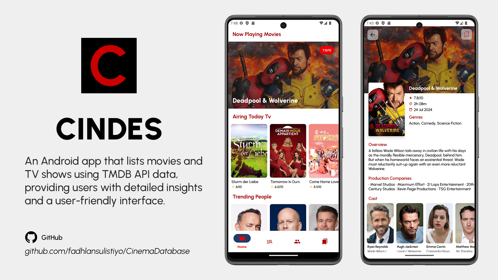
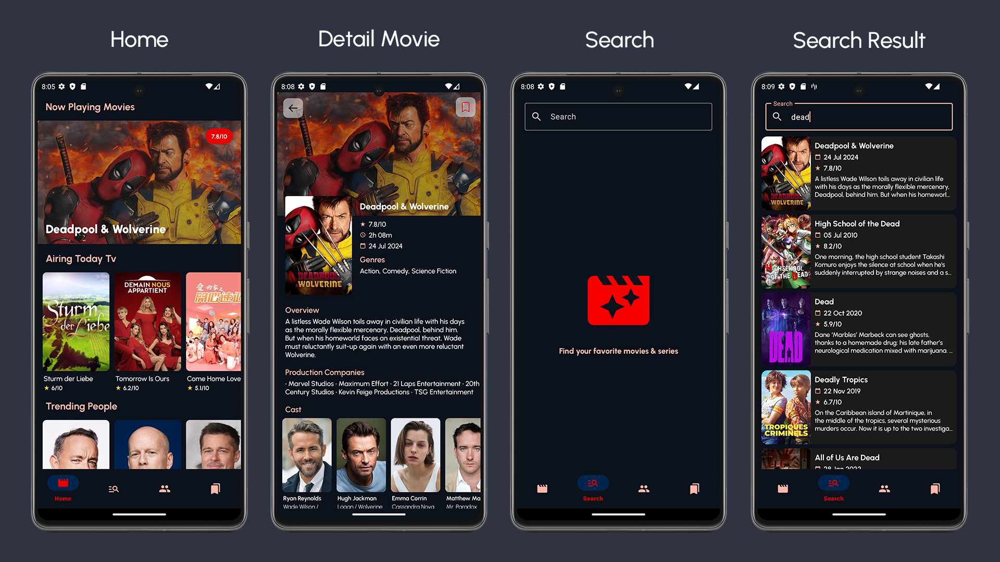
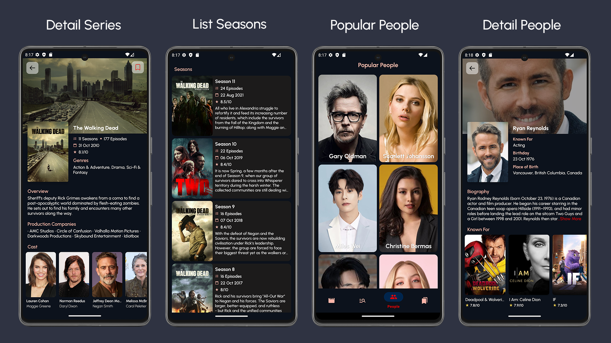
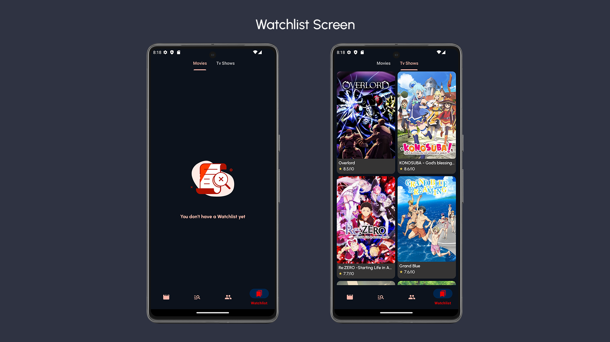
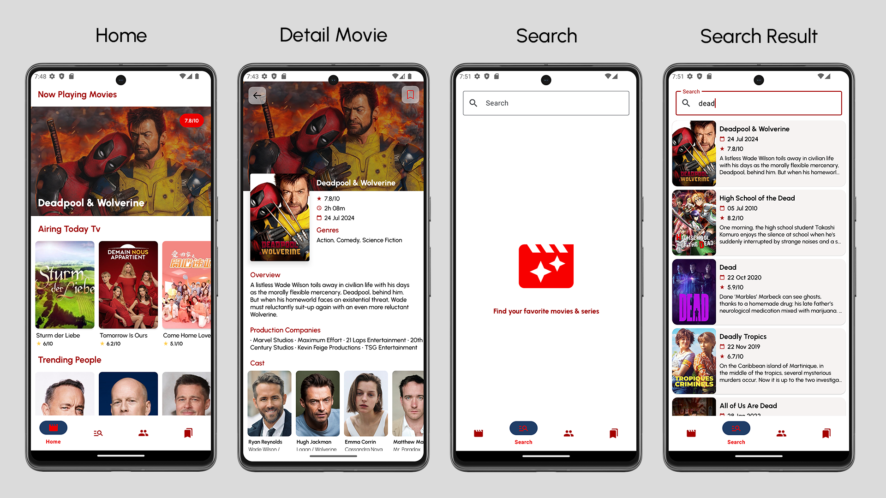
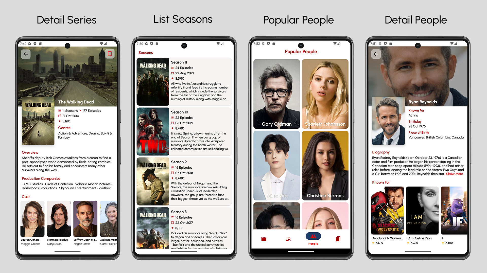
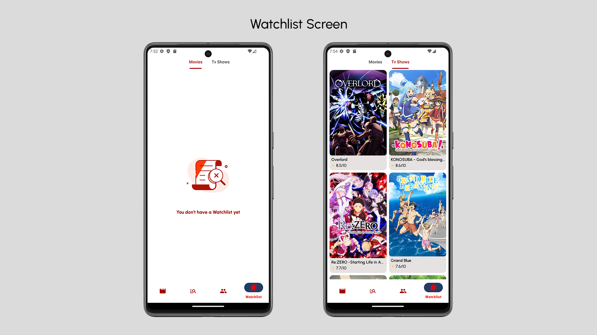

# Cinema Database (CinDes)

Cinema Database (CinDes) is an Android application that showcases a collection of movies and TV shows, with data sourced directly from the TMDB API. Users can easily browse through popular titles, access detailed information, and discover new content. CinDes features a user-friendly interface, designed to provide a smooth and engaging browsing experience.

## Features
- Browse Movies & TV Shows: Explore a vast collection of popular and top-rated movies and TV shows.
- Detailed Information: View comprehensive details about each title, including synopsis, release date, ratings, and more.
- Trending & Popular People: Discover trending and popular actors, directors, and other celebrities, with detailed profiles for each.
- Search Functionality: Quickly find specific movies, TV shows.
- Responsive UI: Enjoy a smooth and intuitive user interface, optimized for various screen sizes.
- Watchlist: Add movies and TV shows to your watchlist for easy access later.
- Offline Access: Access previously viewed content on the home screen even without an internet connection.

## Prerequisites

- Android Studio
- TMDB Api Key (If you have your own)

### Setup Requirement 

1. **Clone the repository**:
    ```bash
    git clone https://github.com/fadhlansulistiyo/CinemaDatabase.git
    ```

2. **Add your TMDB Api Key**:
    - Obtain your API key from the [TMDB Api](https://developer.themoviedb.org).
    - Add the following line to your `build.gradle.kts (Module:core)`
      ```
      buildConfigField("String", "API_KEY", "\"your api key here\"")
      ```

3. **Build and Run the project**

## Tech Stack

- **Architecture**: Clean Architecture (Data, Domain, and Presentation layers)
- **Language**: Kotlin
- **UI**: Jetpack Navigation, ViewPager2, Shimmer, Lottie
- **Networking**: Retrofit, Coroutines Flow
- **Local Storage**: Room, SQLCipher
- **Dependency Injection**: Hilt
- **Pagination**: Paging Library
- **Code Optimization**: ProGuard, LeakCanary
- **Security**: Certificate Pinning
- **Custom UI Components**: ShowMoreText (by Sanjay Prajapat)

## Screenshots (Dark Theme)





## Screenshots (Light Theme)





## Acknowledgments

This project was developed as part of the capstone project for the [Dicoding](https://www.dicoding.com/academies/165) class - Becoming an Android Developer Expert (Dicoding - Menjadi Android Developer Expert). Special thanks to Dicoding for providing comprehensive learning resources and guidance throughout the course.

## CircleCI
[](https://circleci.com/gh/fadhlansulistiyo/CinemaDatabase)
